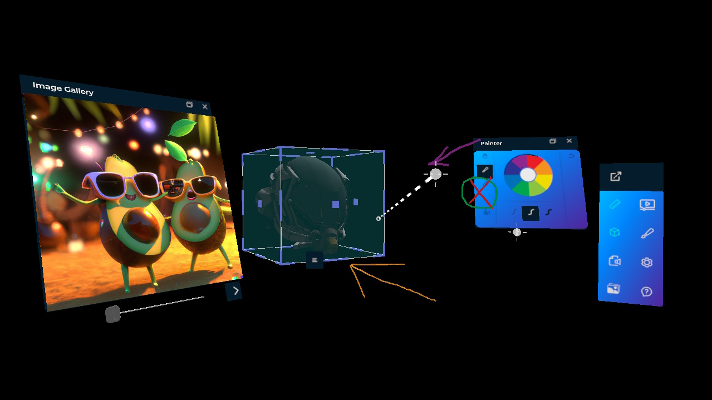

# XRV Sample (preview)

This demo presents a working sample for Evergine XRV core and module add-ons.

For Video Streaming module, we are using a public camera video from 
Kaiskuru Skistadion, Norway.

## Build and Run
- Required Visual Studio 2022 with .NET6 support

## How to use
Please, refer to our public documentation for more information.

----
Powered by **[Evergine](https://evergine.com)**

LET'S CONNECT!

- [Youtube](https://www.youtube.com/channel/UCpA-X92rxM0OuywdVcir9mA)
- [Twitter](https://twitter.com/EvergineTeam)
- [News](https://evergine.com/news/)